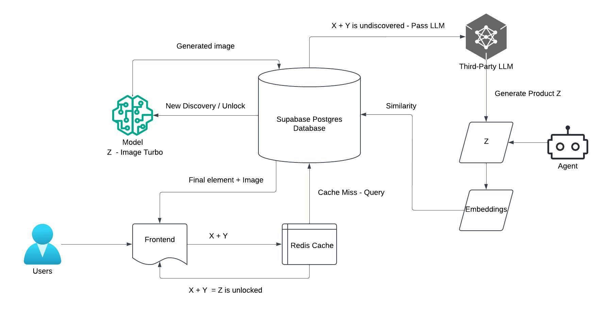

# 🧪 NeuralCraft: Generative Alchemy Engine

> **"Generative Alchemy powered by Large Language Models, Vector Search, and AI Image Generation."**

NeuralCraft is an infinite crafting game where players combine elements to create new ones. Unlike traditional alchemy games with hardcoded recipes, NeuralCraft uses **Generative AI (Groq/LLaMA 3.1)** to determine the result of every combination in real-time, **Vector Embeddings (MiniLM + Supabase pgvector)** to ensure semantic deduplication, and **AI Image Generation (Z-image turbo via FAL API)** to visualize each discovery with unique artwork.

## 🚀 Features

* **🤖 LLM-Powered Synthesis:** Element combinations are determined by LLaMA 3.1-8b-instant. Fire + Earth = Lava because the AI understands physics, not because it was programmed to.
* **🧠 Vector Semantic Memory:** Uses MiniLM embeddings stored in **Supabase pgvector**. The system recognizes that "Rock" and "Stone" are semantically similar, preventing duplicate discoveries.
* **🎨 AI-Generated Imagery:** Every new element is visualized using **Z-image turbo** via the **FAL API**, creating unique, contextual artwork for each discovery.
* **🖱️ Drag-and-Drop Interface:** Smooth, tactile interactions powered by `@dnd-kit`.
* **🏆 Global Leaderboard:** Real-time Hall of Fame tracking the top 10 alchemists by element count.
* **📖 The Grimoire:** A searchable library of all elements you've personally unlocked.
* **🔐 Authentication:** Secure user management with Supabase Auth.

## 🛠️ Tech Stack

### Frontend
* **Framework:** React (Vite)
* **Styling:** Tailwind CSS
* **Interactions:** @dnd-kit/core (Drag & Drop)
* **Notifications:** React Hot Toast
* **State/API:** Axios

### Backend & Data
* **Runtime:** Node.js (Express)
* **Database:** Supabase (PostgreSQL)
* **Vector Search:** pgvector + MiniLM embeddings
* **AI Inference:** Groq API (LLaMA 3.1-8b-instant)
* **Image Generation:** FAL API (Z-image turbo)

## 🎨 Pipeline



## 📦 Installation & Setup

### 1. Clone the Repository
```bash
git clone https://github.com/yourusername/neuralcraft.git
cd neuralcraft
```

### 2. Backend Setup
Navigate to the backend folder and install dependencies:

```bash
cd backend
npm install
```

Create a `.env` file in the backend folder:

```
PORT=5000
SUPABASE_URL=your_supabase_url
SUPABASE_KEY=your_supabase_service_role_key
GROQ_API_KEY=your_groq_api_key
FAL_API_KEY=your_fal_api_key
```

### 3. Frontend Setup
Navigate to the frontend folder and install dependencies:

```bash
cd ../frontend
npm install
```

Create a `.env` file in the frontend folder (for Supabase Auth):

```
VITE_SUPABASE_URL=your_supabase_url
VITE_SUPABASE_ANON_KEY=your_supabase_anon_key
```

### 4. Database Setup (Supabase)
Run the following SQL queries in your Supabase SQL Editor to set up the game logic.

#### A. Enable Vector Extension

```sql
create extension if not exists vector;
```

#### B. Create Tables

```sql
-- 1. Elements Table (Global Knowledge)
create table elements (
  id uuid primary key default uuid_generate_v4(),
  name text not null unique,
  embedding vector(384), -- MiniLM embedding dimension
  image_url text not null,
  discovered_by uuid references auth.users(id),
  created_at timestamp default now()
);

-- 2. Recipes Table (Combination Cache)
create table recipes (
  id uuid primary key default uuid_generate_v4(),
  element1_id uuid references elements(id),
  element2_id uuid references elements(id),
  result_id uuid references elements(id),
  created_at timestamp default now(),
  unique(element1_id, element2_id)
);

-- 3. Grimoire Table (User's Unlocked Elements)
create table grimoire (
  id uuid primary key default uuid_generate_v4(),
  user_id uuid references auth.users(id),
  element_id uuid references elements(id),
  unlocked_at timestamp default now(),
  unique(user_id, element_id)
);

-- 4. Profiles Table (Public User Info)
create table profiles (
  id uuid references auth.users on delete cascade not null primary key,
  username text,
  avatar_url text,
  updated_at timestamp with time zone
);
```

#### C. Triggers (Auto-create Profile on Signup)

```sql
create or replace function public.handle_new_user() 
returns trigger as $$
begin
  insert into public.profiles (id, username, avatar_url)
  values (
    new.id, 
    coalesce(new.raw_user_meta_data->>'full_name', split_part(new.email, '@', 1)),
    new.raw_user_meta_data->>'avatar_url'
  );
  return new;
end;
$$ language plpgsql security definer;

create trigger on_auth_user_created
  after insert on auth.users
  for each row execute procedure public.handle_new_user();
```

#### D. Leaderboard View (Top 10 Users)

```sql
create or replace view leaderboard_view as
select 
  p.username, 
  count(distinct g.element_id) as element_count
from public.profiles p
join public.grimoire g on p.id = g.user_id
group by p.id, p.username
order by element_count desc
limit 10;
```

#### E. Initialize Base Elements

```sql
-- Insert the 4 base elements (Fire, Water, Earth, Air)
insert into elements (name, image_url, discovered_by) values
  ('Fire', 'https://placeholder-for-fire-image.png', null),
  ('Water', 'https://placeholder-for-water-image.png', null),
  ('Earth', 'https://placeholder-for-earth-image.png', null),
  ('Air', 'https://placeholder-for-air-image.png', null);
```

## 🏃‍♂️ Running the Project

Start Backend:

```bash
cd backend
node server.js
```

Start Frontend:

```bash
cd frontend
npm run dev
```

Open http://localhost:5173 to start crafting!

## 🧪 How It Works (The Complete Workflow)

### 1. **User Authentication**
Player signs in using **Supabase Auth**. Upon first login, they automatically receive the 4 base elements: **Fire, Water, Earth, and Air**.

### 2. **Element Combination**
User drags one element onto another to attempt a combination.

### 3. **Recipe Cache Check**
The backend first checks the **recipes table** to see if this exact combination has been tried before:
- **If recipe exists:** Return the cached result immediately (no API calls needed).
- **If recipe is new:** Proceed to AI generation.

### 4. **LLM Generation (LLaMA 3.1-8b-instant)**
Backend sends a prompt to **Groq API** with LLaMA 3.1-8b-instant:
> "What happens when you combine {Element A} and {Element B}? Reply with a JSON object containing the name and a visual description."

The AI generates a new element name (e.g., "Steam" from Water + Fire).

### 5. **Semantic Similarity Check (MiniLM + pgvector)**
The new element name is embedded using **MiniLM** and compared against all existing elements in the database using **cosine similarity**:
- **If similarity score > threshold:** Return the existing similar element (e.g., "Stone" matches "Rock").
- **If no match found:** This is a truly new discovery! Proceed to image generation.

### 6. **AI Image Generation (Z-image turbo via FAL API)**
The new element and its description are sent to **FAL API** using the **Z-image turbo** model to generate a unique image:
- Image URL is returned and stored in the database.
- The new element is saved to the **elements table**.
- The recipe is cached in the **recipes table**.
- The element is unlocked for the user in their **grimoire**.

### 7. **The Grimoire**
A personal collection of all elements the user has unlocked. Searchable and filterable for easy reference.

### 8. **Global Leaderboard**
Displays the **top 10 users** ranked by the total number of unique elements they've discovered. Updated in real-time via SQL views.

## 📄 License
This project is open-source and available under the MIT License.
